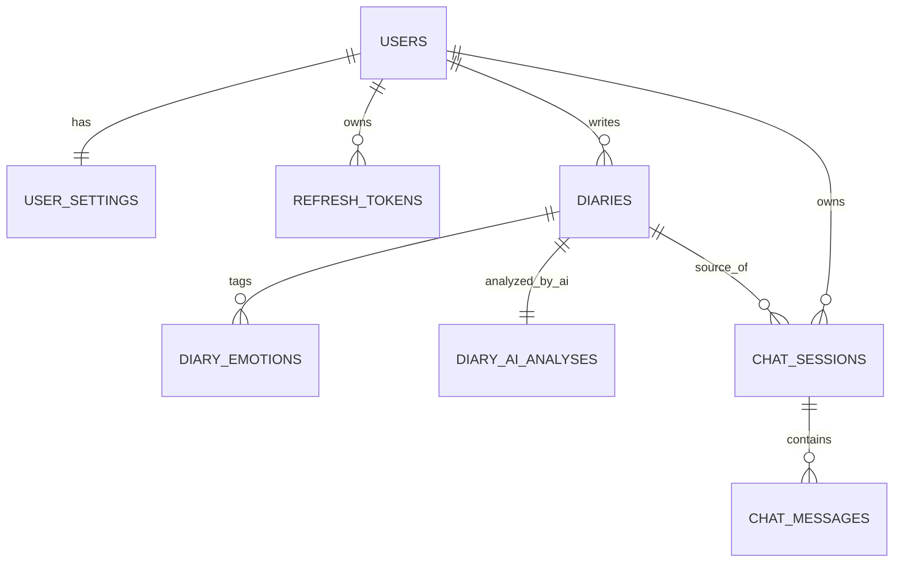

# Mind Compass 테이블 명세서

현재 문서는 `backend-api`의 Flyway 마이그레이션과 JPA 엔티티를 기준으로 정리한 실제 DB 명세서다.
즉, "현재 프로젝트에 실제로 존재하는 테이블"과 "아직 후보 상태인 테이블"을 구분해서 본다.

## 1. 목적

- 현재 Spring Boot 서버가 어떤 테이블을 실제로 사용 중인지 한눈에 본다.
- 각 테이블이 어떤 API/기능과 연결되는지 이해한다.
- ERD 수준의 관계를 간단히 파악한다.
- 향후 `safety_events`, `monthly_reports` 같은 확장 포인트가 어디인지 구분한다.

## 2. 기준 파일

- `backend-api/src/main/resources/db/migration/V1__init.sql`
- `backend-api/src/main/resources/db/migration/V2__diary_emotions.sql`
- `backend-api/src/main/resources/db/migration/V3__diary_ai_analyses.sql`
- `backend-api/src/main/resources/db/migration/V4__chat.sql`
- `backend-api/src/main/resources/db/migration/V5__chat_backfill.sql`
- `backend-api/src/main/resources/db/migration/V6__diary_risk_fields.sql`
- `backend-api/src/main/java/com/mindcompass/api/**/domain/*.java`

## 2-1. 참고 자료

- ERDCloud 초안: `https://www.erdcloud.com/d/tBN8dF4FdXboBi85L`
- ERDCloud import용 SQL: `docs/sql/erdcloud_current_schema.sql`

## 3. 현재 실제 테이블 목록

| 구분 | 테이블명 | 용도 |
|---|---|---|
| 인증 | `users` | 사용자 기본 계정 정보 |
| 인증 | `user_settings` | 앱 잠금, 알림, 응답 모드 같은 사용자 설정 |
| 인증 | `refresh_tokens` | 로그인 유지와 토큰 재발급용 refresh token 해시 |
| 일기 | `diaries` | 사용자가 직접 작성한 일기 본문 |
| 일기 | `diary_emotions` | 일기별 감정 태그 |
| 일기 | `diary_ai_analyses` | 일기 AI 분석/위험도 결과 |
| 채팅 | `chat_sessions` | 사용자별 채팅 세션 |
| 채팅 | `chat_messages` | 세션 안의 사용자/assistant 메시지 |

참고:
- `flyway_schema_history`는 Flyway 관리용 인프라 테이블이라 도메인 명세에서는 제외했다.

## 4. 현재 ERD 요약

## 5. 관계 요약

- `users 1 : 1 user_settings`
- `users 1 : N refresh_tokens`
- `users 1 : N diaries`
- `diaries 1 : N diary_emotions`
- `diaries 1 : 1 diary_ai_analyses`
- `users 1 : N chat_sessions`
- `diaries 1 : N chat_sessions` (`source_diary_id`가 있을 때만 연결)
- `chat_sessions 1 : N chat_messages`

## 6. 테이블별 상세 명세

### 6-1. `users`

왜 필요한가:
- 모든 기능의 사용자 기준점을 만드는 핵심 테이블이다.
- Auth, Diary, Chat, Report 모든 기능이 이 테이블을 기준으로 동작한다.

연결 기능:
- 회원가입 / 로그인 / 내 정보 조회
- 일기 작성/조회
- 채팅 세션/메시지
- 리포트 조회

| 컬럼명 | 타입 | 제약 | 설명 |
|---|---|---|---|
| `id` | `bigserial` | PK | 사용자 ID |
| `email` | `varchar(255)` | NOT NULL, UNIQUE | 로그인 이메일 |
| `password_hash` | `varchar(255)` | NOT NULL | 암호화된 비밀번호 |
| `nickname` | `varchar(50)` | NOT NULL | 닉네임 |
| `status` | `varchar(20)` | NOT NULL | 사용자 상태 (`ACTIVE` 등) |
| `created_at` | `timestamp` | NOT NULL, default current_timestamp | 생성 시각 |
| `updated_at` | `timestamp` | NOT NULL, default current_timestamp | 수정 시각 |
| `deleted_at` | `timestamp` | NULL | 소프트 삭제 시각 |

인덱스/제약:
- PK: `id`
- UNIQUE: `email`

### 6-2. `user_settings`

왜 필요한가:
- 사용자 계정 정보와 설정 정보를 분리해 확장성과 가독성을 확보한다.
- 마이페이지/설정 화면에서 읽기 좋은 구조다.

연결 기능:
- `GET /api/v1/users/me`
- 향후 사용자 설정 변경 API

| 컬럼명 | 타입 | 제약 | 설명 |
|---|---|---|---|
| `id` | `bigserial` | PK | 설정 ID |
| `user_id` | `bigint` | NOT NULL, UNIQUE, FK | 사용자 ID |
| `app_lock_enabled` | `boolean` | NOT NULL, default false | 앱 잠금 여부 |
| `notification_enabled` | `boolean` | NOT NULL, default true | 알림 허용 여부 |
| `daily_reminder_time` | `time` | NULL | 일일 리마인더 시간 |
| `response_mode` | `varchar(30)` | NOT NULL | 응답 모드 (`EMPATHETIC` 등) |
| `created_at` | `timestamp` | NOT NULL | 생성 시각 |
| `updated_at` | `timestamp` | NOT NULL | 수정 시각 |

인덱스/제약:
- PK: `id`
- UNIQUE: `user_id`
- FK: `user_id -> users.id`

### 6-3. `refresh_tokens`

왜 필요한가:
- JWT access token 만료 후 재발급을 위해 refresh token 이력을 저장한다.
- raw token 대신 해시를 저장해서 보안성을 확보한다.

연결 기능:
- `POST /api/v1/auth/refresh`
- 로그인 시 토큰 발급/회전

| 컬럼명 | 타입 | 제약 | 설명 |
|---|---|---|---|
| `id` | `bigserial` | PK | 토큰 이력 ID |
| `user_id` | `bigint` | NOT NULL, FK | 사용자 ID |
| `token_hash` | `varchar(255)` | NOT NULL | refresh token 해시값 |
| `expires_at` | `timestamp` | NOT NULL | 만료 시각 |
| `revoked_at` | `timestamp` | NULL | 폐기 시각 |
| `created_at` | `timestamp` | NOT NULL | 생성 시각 |

인덱스/제약:
- PK: `id`
- FK: `user_id -> users.id`
- INDEX: `idx_refresh_tokens_user_id`
- INDEX: `idx_refresh_tokens_user_hash_active (user_id, token_hash)`

### 6-4. `diaries`

왜 필요한가:
- 서비스의 핵심 기록 데이터다.
- AI가 실패해도 반드시 저장이 유지돼야 하는 기준 테이블이다.

연결 기능:
- Diary CRUD
- Calendar 조회
- Report 집계
- Chat source diary 연결

| 컬럼명 | 타입 | 제약 | 설명 |
|---|---|---|---|
| `id` | `bigserial` | PK | 일기 ID |
| `user_id` | `bigint` | NOT NULL, FK | 작성 사용자 |
| `title` | `varchar(100)` | NOT NULL | 일기 제목 |
| `content` | `text` | NOT NULL | 일기 본문 |
| `primary_emotion` | `varchar(30)` | NULL | 대표 감정 |
| `emotion_intensity` | `integer` | NULL, CHECK 1~5 | 감정 강도 |
| `written_at` | `timestamp` | NOT NULL | 사용자가 기록한 날짜/시간 |
| `created_at` | `timestamp` | NOT NULL | 생성 시각 |
| `updated_at` | `timestamp` | NOT NULL | 수정 시각 |
| `deleted_at` | `timestamp` | NULL | 소프트 삭제 시각 |

인덱스/제약:
- PK: `id`
- FK: `user_id -> users.id`
- CHECK: `emotion_intensity between 1 and 5`
- INDEX: `idx_diaries_user_id`
- INDEX: `idx_diaries_user_written_at`
- INDEX: `idx_diaries_user_deleted_at`

### 6-5. `diary_emotions`

왜 필요한가:
- 대표 감정 하나만으로는 부족하므로, 일기별 다중 감정 태그를 저장한다.
- 사용자 입력 태그와 AI 분석 태그를 분리 저장할 수 있다.

연결 기능:
- Diary create/update
- Diary detail
- AI 분석 태그 반영

| 컬럼명 | 타입 | 제약 | 설명 |
|---|---|---|---|
| `id` | `bigserial` | PK | 감정 태그 ID |
| `diary_id` | `bigint` | NOT NULL, FK | 연결된 일기 ID |
| `emotion_code` | `varchar(30)` | NOT NULL | 감정 코드 |
| `intensity` | `integer` | NULL, CHECK 1~5 | 감정 강도 |
| `source_type` | `varchar(20)` | NOT NULL | `USER`, `AI_ANALYSIS` |
| `created_at` | `timestamp` | NOT NULL | 생성 시각 |

인덱스/제약:
- PK: `id`
- FK: `diary_id -> diaries.id`
- CHECK: `intensity between 1 and 5`
- INDEX: `idx_diary_emotions_diary_id`
- INDEX: `idx_diary_emotions_diary_source`

### 6-6. `diary_ai_analyses`

왜 필요한가:
- 사용자가 쓴 일기 원문과 AI 해석 결과를 분리 저장하기 위해 별도 테이블로 둔다.
- 감정 분석 결과와 위험도 결과를 함께 관리한다.

연결 기능:
- ai-api `analyze-diary`
- ai-api `risk-score`
- Diary detail
- Report 위험도 집계

| 컬럼명 | 타입 | 제약 | 설명 |
|---|---|---|---|
| `id` | `bigserial` | PK | AI 분석 ID |
| `diary_id` | `bigint` | NOT NULL, UNIQUE, FK | 연결된 일기 ID |
| `primary_emotion` | `varchar(30)` | NULL | AI가 해석한 대표 감정 |
| `emotion_intensity` | `integer` | NULL, CHECK 1~5 | AI가 해석한 감정 강도 |
| `summary` | `text` | NULL | 일기 요약 |
| `confidence` | `numeric(4,3)` | NULL | AI 분석 신뢰도 |
| `raw_payload` | `text` | NULL | ai-api 원본 응답 저장 |
| `risk_level` | `varchar(20)` | NULL | 위험도 (`LOW`, `MEDIUM`, `HIGH`) |
| `risk_score` | `numeric(4,3)` | NULL | 위험 점수 |
| `risk_signals` | `text` | NULL | 위험 신호 목록 |
| `recommended_action` | `varchar(40)` | NULL | 권장 액션 (`SUPPORTIVE_RESPONSE`, `SAFETY_RESPONSE`) |
| `created_at` | `timestamp` | NOT NULL | 생성 시각 |
| `updated_at` | `timestamp` | NOT NULL | 수정 시각 |

인덱스/제약:
- PK: `id`
- UNIQUE: `diary_id`
- FK: `diary_id -> diaries.id`
- CHECK: `emotion_intensity between 1 and 5`
- INDEX: `idx_diary_ai_analyses_diary_id`

### 6-7. `chat_sessions`

왜 필요한가:
- 사용자의 대화 단위를 세션으로 묶어 채팅 히스토리를 관리한다.
- 특정 diary에서 채팅을 이어 시작했는지도 추적할 수 있다.

연결 기능:
- Chat session create/list/detail
- Diary detail -> chat 연결

| 컬럼명 | 타입 | 제약 | 설명 |
|---|---|---|---|
| `id` | `bigserial` | PK | 세션 ID |
| `user_id` | `bigint` | NOT NULL, FK | 세션 소유자 |
| `source_diary_id` | `bigint` | NULL, FK | 연결된 원본 일기 ID |
| `title` | `varchar(100)` | NOT NULL | 세션 제목 |
| `created_at` | `timestamp` | NOT NULL | 생성 시각 |
| `updated_at` | `timestamp` | NOT NULL | 수정 시각 |

인덱스/제약:
- PK: `id`
- FK: `user_id -> users.id`
- FK: `source_diary_id -> diaries.id`
- INDEX: `idx_chat_sessions_user_id`
- INDEX: `idx_chat_sessions_user_updated_at`

### 6-8. `chat_messages`

왜 필요한가:
- 채팅 세션 안에서 주고받는 사용자/assistant 메시지를 저장한다.
- Safety/Supportive/Fallback 응답도 결국 assistant 메시지로 기록된다.

연결 기능:
- Chat message send
- Chat session detail
- Safety Net 결과 저장

| 컬럼명 | 타입 | 제약 | 설명 |
|---|---|---|---|
| `id` | `bigserial` | PK | 메시지 ID |
| `session_id` | `bigint` | NOT NULL, FK | 연결된 세션 ID |
| `role` | `varchar(20)` | NOT NULL | `USER`, `ASSISTANT` |
| `content` | `text` | NOT NULL | 메시지 본문 |
| `created_at` | `timestamp` | NOT NULL | 생성 시각 |

인덱스/제약:
- PK: `id`
- FK: `session_id -> chat_sessions.id`
- INDEX: `idx_chat_messages_session_id`
- INDEX: `idx_chat_messages_session_created_at`

## 7. 현재는 없는 후보 테이블

아래는 README/skill/설계 상으로는 후보였지만, 현재 코드와 Flyway 기준으로는 아직 실제 테이블이 아니다.

| 테이블명 | 현재 상태 | 비고 |
|---|---|---|
| `safety_events` | 미구현 | Safety Net은 현재 `chat_messages`, `diary_ai_analyses`로 추적 |
| `monthly_reports` | 미구현 | Report는 현재 조회 시점 집계 방식 |
| `ai_response_logs` | 미구현 | 현재 원시 AI payload는 `diary_ai_analyses.raw_payload`만 저장 |

## 8. 구현 우선순위 관점 요약

현재 기준:
1. Auth/User 스키마
2. Diary/Diary AI 스키마
3. Chat 스키마
4. Report는 테이블 없이 조회 집계
5. Safety는 별도 이벤트 테이블 없이 위험도 컬럼과 채팅 응답으로 운영

즉, 지금 스키마는 "MVP용 최소 구조"로 보는 것이 맞다.

## 9. 다음 확장 후보

- `safety_events`를 추가해서 고위험 이벤트 이력 저장
- `ai_response_logs`를 추가해서 Chat/Diary AI 호출 로그 분리
- `monthly_reports`를 materialized summary처럼 별도 저장할지 검토

## 10. 빠른 요약

- 현재 실제 도메인 테이블은 8개다.
- 핵심 저장축은 `users -> diaries -> diary_ai_analyses`, `users -> chat_sessions -> chat_messages`다.
- Report는 별도 테이블 저장이 아니라 조회 시 집계다.
- Safety는 현재 별도 이벤트 테이블 없이 AI 위험도 컬럼과 채팅 분기로 처리한다.
