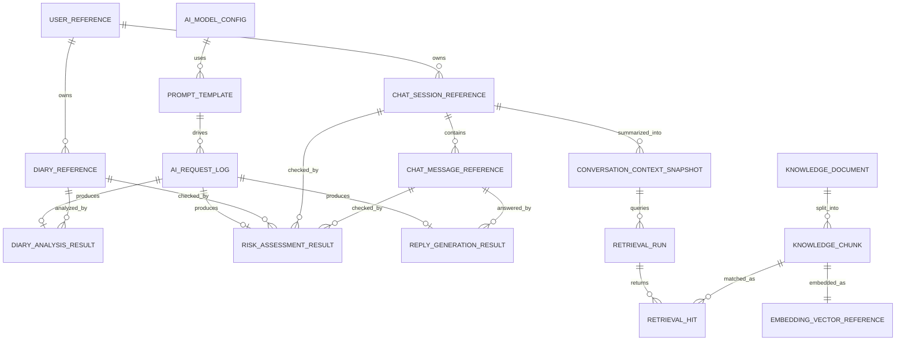

# ai-api Logical ERD Draft

이 문서는 `ai-api`와 주변 AI 서브시스템을 위한 logical ERD 초안이다.

중요한 전제:
- 현재 핵심 영속 데이터의 소스 오브 트루스는 `backend-api` 쪽이다.
- 이 문서는 “지금 이미 DB에 있다”가 아니라 “ai-api를 안정적으로 운영/확장할 때 어떤 논리 엔티티가 필요한가”를 정리한 것이다.
- 그래서 physical table 확정안이 아니라 logical model 문서다.

---

## 1. Goal

- `ai-api`가 어떤 데이터를 읽고 어떤 결과를 남기면 좋은지 큰 그림을 잡는다.
- diary 분석, risk scoring, reply generation, RAG, 운영 로그를 한 구조 안에서 설명한다.
- 나중에 PostgreSQL, Redis, Vector DB, S3 같은 실제 저장소로 나눌 때 기준점으로 사용한다.

---

## 2. Design Principles

- 사용자 원본 데이터는 계속 `backend-api`가 소유한다.
- `ai-api`는 복제된 비즈니스 원본이 아니라 AI 처리 결과와 운영 메타데이터를 중심으로 가진다.
- prompt template, model config, request log, analysis result, retrieval artifact는 분리한다.
- RAG 문서와 chunk, embedding은 명시적으로 분리한다.
- safety 관련 결과는 chat/diary와 연결되지만 과도하게 강결합하지 않는다.

---

## 3. Logical Entity List

- `user_reference`
- `diary_reference`
- `chat_session_reference`
- `chat_message_reference`
- `ai_model_config`
- `prompt_template`
- `ai_request_log`
- `diary_analysis_result`
- `risk_assessment_result`
- `reply_generation_result`
- `conversation_context_snapshot`
- `knowledge_document`
- `knowledge_chunk`
- `embedding_vector_reference`
- `retrieval_run`
- `retrieval_hit`

---

## 4. Relationship Summary

- `user_reference` 1:N `diary_reference`
- `user_reference` 1:N `chat_session_reference`
- `chat_session_reference` 1:N `chat_message_reference`
- `ai_model_config` 1:N `prompt_template`
- `prompt_template` 1:N `ai_request_log`
- `ai_request_log` 1:0..1 `diary_analysis_result`
- `ai_request_log` 1:0..1 `risk_assessment_result`
- `ai_request_log` 1:0..1 `reply_generation_result`
- `chat_session_reference` 1:N `conversation_context_snapshot`
- `knowledge_document` 1:N `knowledge_chunk`
- `knowledge_chunk` 1:1 `embedding_vector_reference`
- `retrieval_run` 1:N `retrieval_hit`
- `retrieval_run` N:1 `conversation_context_snapshot`
- `retrieval_hit` N:1 `knowledge_chunk`

---

## 5. Mermaid ERD

---

## 6. Entity Explanations

### `user_reference`

- Why:
  - `ai-api`가 완전한 사용자 테이블을 복제하지 않고도 누가 요청 주체인지 연결하기 위한 최소 참조 엔티티다.
- Stores:
  - `user_id`
  - locale, timezone 같은 AI 응답 품질에 필요한 최소 메타데이터
- Depends on:
  - 모든 AI 결과 엔티티의 공통 소유 주체
- FK:
  - 사실상 외부 `backend-api.users`를 바라보는 논리 키

### `diary_reference`

- Why:
  - diary 원문은 `backend-api`에 있지만, 어떤 AI 분석 결과가 어느 diary에 연결되는지는 필요하다.
- Stores:
  - `diary_id`, `user_id`, `written_at`
- Depends on:
  - analyze-diary, risk-score on diary

### `chat_session_reference`

- Why:
  - chat reply generation과 retrieval context를 세션 단위로 묶기 위해 필요하다.
- Stores:
  - `session_id`, `user_id`, created_at
- Depends on:
  - generate-reply, risk-score

### `chat_message_reference`

- Why:
  - 어떤 사용자 메시지에 대해 어떤 risk result와 reply result가 생겼는지 추적하기 위해 필요하다.
- Stores:
  - `message_id`, `session_id`, role, created_at
- Depends on:
  - risk-score, generate-reply

### `ai_model_config`

- Why:
  - 어떤 모델, 어떤 provider, 어떤 temperature로 응답했는지 운영 추적이 필요하다.
- Stores:
  - provider, model name, temperature, max tokens, active flag
- Depends on:
  - 모든 prompt 기반 AI 요청

### `prompt_template`

- Why:
  - analyze, risk, reply마다 서로 다른 시스템 프롬프트 버전을 관리하기 위해 필요하다.
- Stores:
  - template type, version, template body, rollout status
- Depends on:
  - `ai_request_log`

### `ai_request_log`

- Why:
  - 내부 AI 호출 운영 추적의 중심 엔티티다.
- Stores:
  - request type, user/session/diary/message reference
  - prompt template version
  - model config
  - request payload summary
  - raw response summary
  - success/fallback/error status
  - latency
- Depends on:
  - 모든 결과 엔티티의 부모 로그

### `diary_analysis_result`

- Why:
  - diary 분석 결과를 구조화된 형식으로 저장하기 위한 엔티티다.
- Stores:
  - primary emotion
  - intensity
  - tags
  - summary
  - confidence
  - fallback reason
- Depends on:
  - diary detail, calendar aggregation, monthly report

### `risk_assessment_result`

- Why:
  - 위험 점수와 safety 분기를 기록하기 위해 필요하다.
- Stores:
  - risk level, risk score, detected signals, recommended action
  - source type
  - fallback reason
- Depends on:
  - chat safety branch, diary safety net, safety auditing

### `reply_generation_result`

- Why:
  - 어떤 답변이 생성됐고 어떤 confidence와 responseType이 붙었는지 기록하기 위해 필요하다.
- Stores:
  - reply text
  - confidence
  - response type
  - fallback flag
  - optional evidence summary
- Depends on:
  - chat assistant response persistence

### `conversation_context_snapshot`

- Why:
  - chat 세션의 긴 문맥을 그대로 매번 보내지 않기 위해 요약 스냅샷이 필요하다.
- Stores:
  - session_id
  - summary text
  - source message range
  - version
- Depends on:
  - future memorySummary automation
  - RAG context assembly

### `knowledge_document`

- Why:
  - RAG에 사용할 상담 가이드, safety resource, 정책 문서를 논리적으로 관리한다.
- Stores:
  - title, source type, source uri, language, status
- Depends on:
  - retrieval

### `knowledge_chunk`

- Why:
  - 문서를 검색 가능한 작은 단위로 쪼개기 위해 필요하다.
- Stores:
  - document_id
  - chunk text
  - chunk order
  - token count
- Depends on:
  - embedding, retrieval hit

### `embedding_vector_reference`

- Why:
  - 벡터 자체를 DB에 직접 안 넣더라도 어떤 chunk가 어떤 vector store id와 연결되는지 알아야 한다.
- Stores:
  - chunk_id
  - vector store provider
  - vector key
  - embedding model

### `retrieval_run`

- Why:
  - 어떤 질문에 어떤 검색이 수행됐는지 기록하기 위해 필요하다.
- Stores:
  - query text
  - retrieval mode
  - top-k
  - latency
  - linked snapshot id
- Depends on:
  - future evidence-based reply generation

### `retrieval_hit`

- Why:
  - 검색 결과가 어떤 chunk였고 어떤 점수였는지 저장하기 위해 필요하다.
- Stores:
  - retrieval_run_id
  - chunk_id
  - rank
  - similarity score

---

## 7. Suggested SQL-Oriented Mapping

논리 엔티티를 실제 저장소로 옮길 때 추천 방향은 아래와 같다.

| Logical entity | Likely storage |
| --- | --- |
| `user_reference`, `diary_reference`, `chat_session_reference`, `chat_message_reference` | `backend-api` PK 참조만 보유 |
| `ai_model_config`, `prompt_template`, `ai_request_log` | PostgreSQL |
| `diary_analysis_result`, `risk_assessment_result`, `reply_generation_result` | PostgreSQL |
| `conversation_context_snapshot` | PostgreSQL or Redis |
| `knowledge_document`, `knowledge_chunk` | PostgreSQL |
| `embedding_vector_reference` | PostgreSQL + external vector store |
| `retrieval_run`, `retrieval_hit` | PostgreSQL |

---

## 8. What Should Stay Outside ai-api DB

- 사용자 인증 정보
- refresh token
- diary 원본 본문
- chat 원본 메시지의 authoritative copy
- report 최종 집계본

이 데이터는 계속 `backend-api`가 소유하는 편이 맞다.

---

## 9. Next Step

- 이 logical ERD를 바탕으로 실제 persistent scope를 줄일지 넓힐지 먼저 결정한다.
- 만약 MVP에서 `ai-api` DB를 바로 두지 않는다면:
  - `ai_model_config`
  - `prompt_template`
  - `ai_request_log`
  - `knowledge_document`
  - `knowledge_chunk`
부터 우선 후보로 좁힐 수 있다.
- 이후 필요하면 PostgreSQL DDL 초안과 실제 ERD 이미지를 별도 문서로 확장한다.
